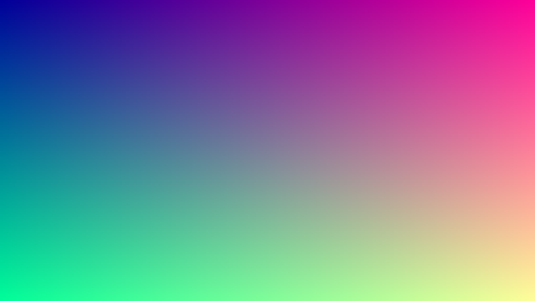
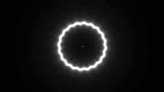

# nativeshadr


<!-- README.md is generated from README.Rmd. Please edit that file -->

<!-- badges: start -->

[](https://lifecycle.r-lib.org/articles/stages.html#experimental)
<!-- badges: end -->

## Overview

nativeshadr is an experimental R package for developers to assist
writing pixel shaders as Rcpp codes. It brings
[HLSL](https://en.wikipedia.org/wiki/HLSL)-like syntax via the
[HLSL++](https://github.com/redorav/hlslpp) library so that users can
write pseudo HLSL shaders in Rcpp.

## Usage

Typical usage of nativeshadr is as follows:

- Write a pixel shader as Rcpp codes.
  - A pixel shader here is expected to have the signature
    `shader(int2 wh, Rcpp::IntegerMatrix nr, Rcpp::List uniforms)`,
    where `wh` is the position of a pixel in the texture, `nr` is a
    ‘nativeRaster’ object that represents the texture, and `uniforms` is
    a list of uniforms.
  - The pixel shader should return an `uint32_t` value that represents
    the color of the pixel as the same manner in ‘nativeRaster’ objects.
- Wrap the pixel shader and export it.
  - For convenience, `vectorize_shader()` is provided, which takes a
    pixel shader as its argument and returns a vectorized function.
- Call the function with a ‘nativeRaster’ object and a list of uniforms.

## Examples

In order to enable completion in your IDE, it is highly recommended to
write shaders as R packages. However, you can also write them as scripts
and compile them with `Rcpp::sourceCpp()`.

### Simple gradient

``` r
library(nara) ## https://github.com/coolbutuseless/nara

Rcpp::sourceCpp(code = R"{
// [[Rcpp::depends(nativeshadr)]]
#include <nativeshadr.h>

uint32_t gradient(int2 wh, Rcpp::IntegerMatrix nr, Rcpp::List uniforms) {
  float2 uv = float2(wh) / float2(nr.ncol(), nr.nrow());
  float4 col = float4(uv.x, uv.y, .6, 1);
  return int4_to_icol(clamp(col * 255, 0, 255));
}

// [[Rcpp::export]]
Rcpp::IntegerVector test_gradient(Rcpp::IntegerMatrix nr, Rcpp::List uniforms) {
  return vectorize_shader(gradient)(nr, uniforms);
}
}")

test_gradient(nara::nr_new(640, 360), list()) |>
  plot()
```



### Waved ring

``` r
Rcpp::sourceCpp(code = R"{
// [[Rcpp::depends(nativeshadr)]]
#include <nativeshadr.h>

uint32_t ring(int2 wh, Rcpp::IntegerMatrix nr, Rcpp::List uniforms) {
  Rcpp::NumericVector mouse = uniforms["mouse"];
  Rcpp::NumericVector time = uniforms["time"];

  float2 resolution = float2(nr.ncol(), nr.nrow());
  float2 m = float2(mouse[0] * 2.0 - 1.0, -1.0 * mouse[1] * 2.0 + 1.0);
  float2 p = (float2(wh) * 2.0 - resolution) / min(resolution.x, resolution.y);

  float u = sin((hlslpp::atan2(p.y, p.x) + time[0] * .5) * 20.0) * .01;
  float t = 0.02 / abs((sin(time[0]) + 1.0) * 0.5 + u - length(p));
  return int4_to_icol(clamp(float4(t, t, t, 1.0) * 255, 0, 255));
}

// [[Rcpp::export]]
Rcpp::IntegerVector test_ring(Rcpp::IntegerMatrix nr, Rcpp::List uniforms) {
  return vectorize_shader(ring)(nr, uniforms);
}
}")

timing <- Sys.time()
fig_path <-
  gifski::save_gif(
    {
      for (frame in seq(0, 4 * pi, length.out = 60)) {
        img <- test_ring(nara::nr_new(640, 360), list(mouse = c(0.5, 0.5), time = frame * 1000))
        grid::grid.newpage()
        grid::grid.raster(img, interpolate = FALSE)
      }
    },
    width = 320,
    height = 180,
    gif_file = "man/figures/README-example-animated-ring.gif",
    delay = 1 / 12
  )
Sys.time() - timing
#> Time difference of 9.979378 secs
```



## License

MIT license.
